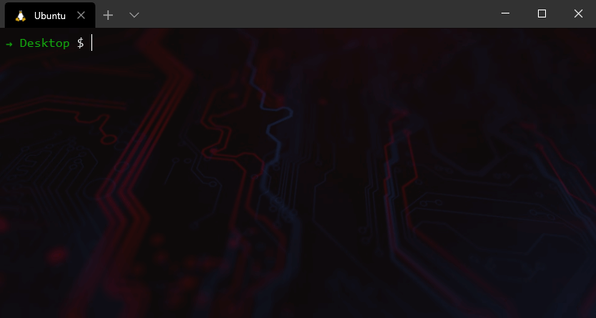
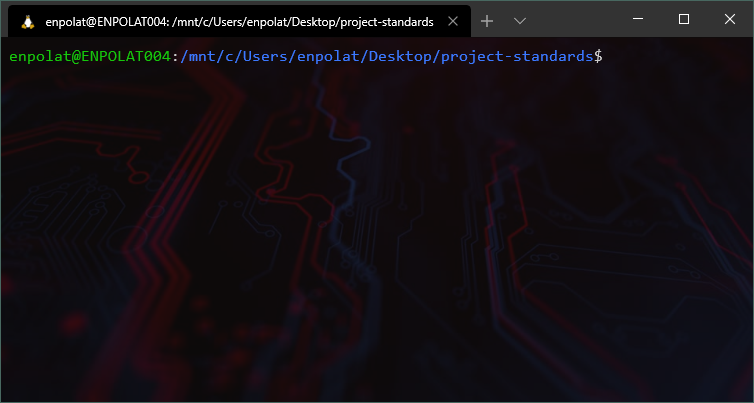
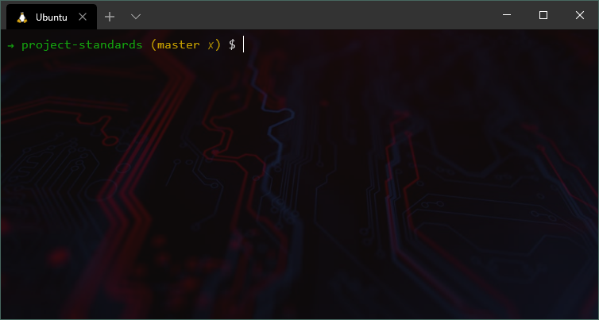

# What are DotFiles


*DotFiles* (files with dot `.` at the beginning of their names, such as, *.bash_aliases*, *.bash_profile*, etc.) are basically text-based configuration files.

> The legend goes that dot-files arose from a bug in the earliest days of UNIX: in an effort to avoid listing the . and .. entries of a directory, the ls command skipped files that began with the '.' character.
As a result, any file with a name beginning with '.' was not reported by ls, i.e. it was a "hidden" file.
A user's home directory was a convenient place to put user-specific configuration files, but such files were also an eyesore; one popular solution to this problem was to make those configuration files hidden so that they wouldn't annoy the user.
Thus, the tradition of dot-files was born.

You can use my `dotfiles` by executing following command on Terminal

```bash
sudo bash -c "$(curl -fsSL https://raw.githubusercontent.com/polatengin/dotfiles/configure.sh)"
```

In the [.bash_aliases](./.bash_aliases) file, you can find some aliases for _Bash_.

If you want to grab your _internal_ or _external_ IP address, every time you need to run following commands on _Terminal_

```bash
# Internal IP
ifconfig | grep -Eo 'inet (addr:)?([0-9]*\.){3}[0-9]*' | grep -Eo '([0-9]*\.){3}[0-9]*' | grep -v '127.0.0.1'

# External IP
dig +short myip.opendns.com @resolver1.opendns.com
```

If you want to test your internet speed with _100Mb_ of file, you can use web pages, such as [SpeedTest by Ookla](https://www.speedtest.net/), or you can run following command on _Terminal_

```bash
wget -O /dev/null http://speed.transip.nl/100mb.bin
```



Also, by default, _Bash_ will tell _Terminal_ window to display `username@computername current_directory_from_root$` at the beginning of the command line.



If you want to change this pattern you need to change global `PS1` variable.

In the [.bash_profile](./.bash_profile) file, you can find couple of helper methods and exposed `PS1` variable to make it `➜ current_directory_name $`

Other than that, with the helper methods, it can understand if you're in a _git_ folder and parse the current _git branch_.

Also, it can understand if the current _git branch_ has some changes didn't pushed to the repo yet and add `✗` character at the end.



## References

[What are dotfiles](https://www.quora.com/What-are-dotfiles)

[Git Status Documentation](https://git-scm.com/docs/git-status)
